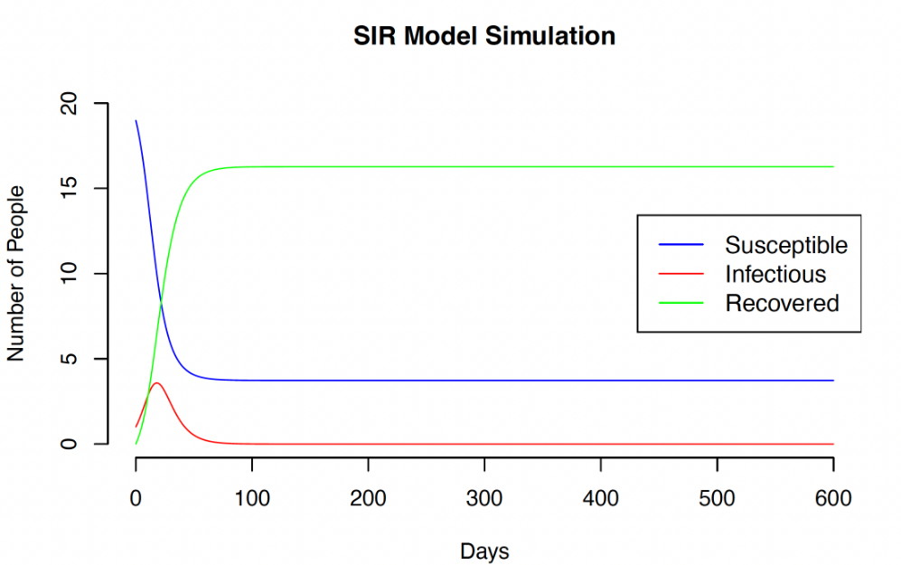

# 📊 Computational Work Portfolio  
This portfolio contains samples of my work across various areas of data analysis, statistical modeling, data visualization, and website design.
  

## 🧑‍💻 Work Samples  
Below are repositories of my computational work samples:
  
### [🔗 Portfolio Website](https://github.com/darlenecheong/Personal-Website)
  
A personal portfolio website built using HTML, CSS, and JavaScript, showcasing my background and projects.
  

### [🔗 SIR Model Simulation](https://github.com/darlenecheong/Simulating-Disease-Dynamics)
  
This project uses a Susceptible-Infected-Recovered (SIR) model to simulate and analyze the spread of infectious diseases, exploring the impact of infection and recovery rates on disease dynamics over time.
  

### [🔗 Portfolio Website](https://darlenecheong.github.io/Personal-Website/)
  
A personal portfolio website built using HTML, CSS, and JavaScript, showcasing my background and projects.

  

## 📄 Publications
- **[Rapid surveillance of New York City healthcare center egress behaviors during the 2020 COVID-19 lockdown](https://www.nature.com/articles/s41597-023-02692-0)** – Published in *Scientific Data (Nature)*, this project was a 9-week observational study that established a protocol and archival dataset describing the egress behaviors of individuals leaving healthcare centers in New York City during the 2020 COVID-19 PAUSE order.

  

## 📬 Contact Me  
- **Email**: [darlenecheongsw@gmail.com](mailto:darlenecheongsw@gmail.com)  
- **LinkedIn**: [linkedin.com/in/darlenecheong](https://www.linkedin.com/in/darlenecheong/)
